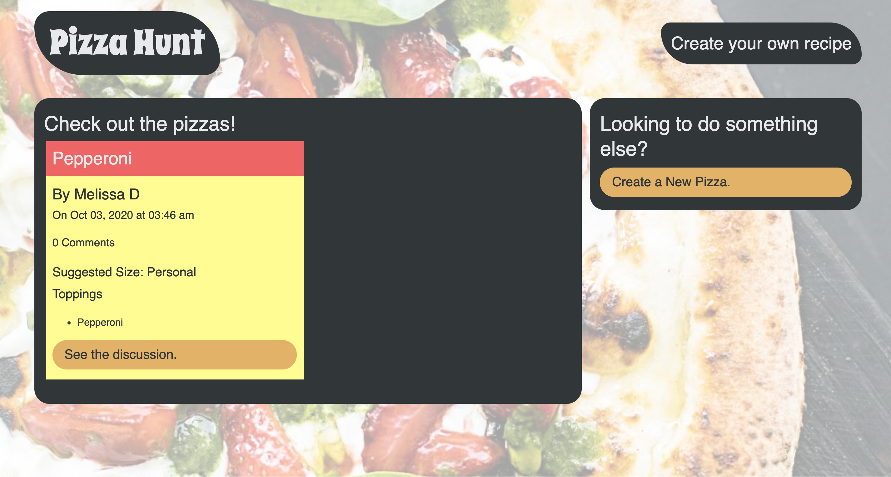
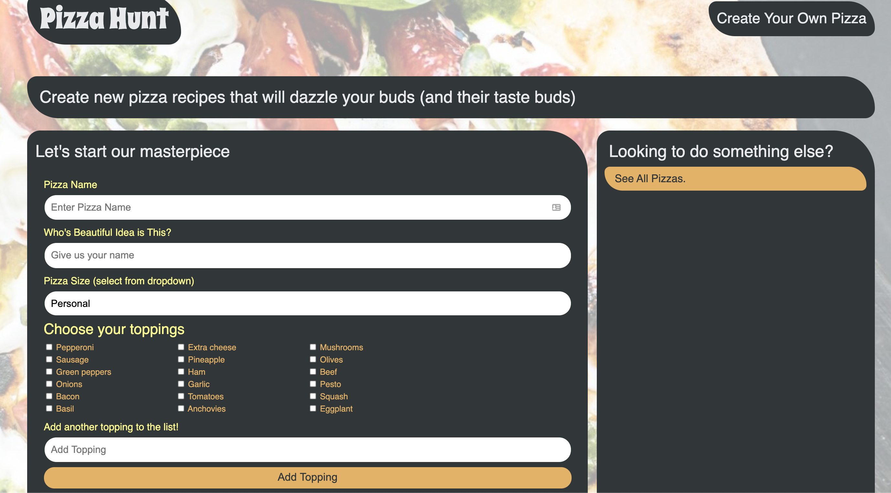

<h1 align="center">Pizza Hunt</h1>

    
    
    

  

    
    

  

## Table of Contents
- [Description](#description)
- [Questions](#questions)

## Description
Pizza Hunt is a social media receipt app where users can post their creative spins on pizza, add comments to receipes and create threads within comments. Utilizes a RESTful API for a social network using the Mongoose Object-Document Mapper to interact with a MongoDB database. Implements client-side storage using IndexedDB to save data locally when there is no internet connection.

## Questions
If you have any questions, you can reach me by emailing [melissa.daska@gmail.com](mailto:melissa.daska@gmail.com) or follow the link to my gitHub profile [melissadaska](https://github.com/melissadaska).
